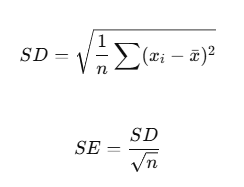
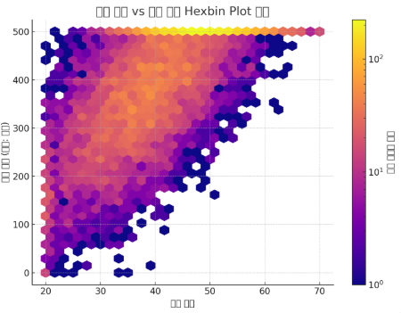

# 데이터와 표본분포
## 모집단에서 표본 추출

**완결성, 일관성, 깨끗함, 정확성, 대표성**

> 1. 임의표본추출 = 무작위추출(임의방식)
> 표본 : 단순임의표본(층화 x) 
>
> if 중복 가능 : 복원추출 / 중복 불가능 : 비복원추출

> 2. 층화표본추출 = 층 나눈 후 추출(비임의방식)
> 표본의 모집단 대표성 강화의 목적

## 통계 분석 과정에서 발생 가능한 오류
> 1. 선택편향(표본추출단계에서의 오류) : 특정 집단이 과도하게 포함되거나 배제될 경우 전체 모집단을 대표하지 못하는 현상
> 2. 데이터 스누핑(분석/모델링 단계에서의 오류) : 분석 전 데이터를 너무 많이 들여다보거나 데이터에 맞춰 모델을 반복 조정해서 *우연한 패턴을 유의미한 결과로 착각* 하는 오류 
> 3. 방대한 검색 효과(가설 검정 단계에서의 오류) : 너무 많은 가설 검정으로 인해 우연히 유의미해 보이는 결과가 발생 

## 평균으로의 회귀
> 어떤 값이 극단적으로 높거나 낮게 나타난 후, 다음 측정에서는 평균에 가까운 값으로 돌아오는 현상 
>
> 예시
> - 중간고사 100점 -> 기말고사 80점 (극단적으로 높았던 점수가 평균으로 회귀)
> - 축구 경기 1차전 5:0 -> 2차전 1:1 (운이 작용한 결과가 평균으로 회귀)
>
> 주의사항 : 평균으로의 회귀를 실력 변화, 개입효과 등으로 착각하면 안됨

## 표본분포
| 항목             | 표준편차 (Standard Deviation, SD)                            | 표준오차 (Standard Error, SE)                            |
|------------------|-------------------------------------------------------------|----------------------------------------------------------|
| 의미             | 데이터가 평균에서 얼마나 퍼져 있는지를 나타냄               | 표본평균이 실제 모집단 평균을 얼마나 잘 추정하는지 나타냄 |
| 측정 대상        | 개별 데이터 값의 흩어짐                                      | 여러 표본평균 값의 흩어짐                                 |
| 사용 목적        | 데이터의 변동성 파악                                         | 표본평균의 신뢰도/정확도 평가                            |
| 사용 위치        | 모집단 또는 단일 표본 내의 분산 측정                         | 표본평균의 표본분포 분석                                  |
| 표본 크기와 관계 | 표본 크기와 무관                                             | 표본 크기가 클수록 작아짐                                 |
| 값의 크기        | 일반적으로 SE보다 큼                                         | 일반적으로 SD보다 작음                                    |

> 왜 SE가 SD보다 작을까?
> - SD : 원래 데이터의 변동 그 자체
> - SE : 여러 표본들이 전체 평균에서 얼마나 흩어지는지
> - 계산식
>
>
>
> => SE는 SD를 n의 제곱근으로 나눈 값이기 때문에 항상 작거나 같고, 표본이 클수록 표본평균은 더 안정되므로 SE는 작아짐
>
> **중심극한정리** (SE와 연관) : 표본 평균들이 정규분포를 따르게 됨

## 데이터분포 vs 표본 분포
| 항목             | 데이터 분포 (모집단 분포)                           | 표본 분포 (Sampling Distribution)                       |
|------------------|--------------------------------------------------|--------------------------------------------------------|
| 정의             | 모집단의 모든 데이터가 어떤 형태로 분포하는지      | 표본 통계량(예: 평균, 비율 등)이 반복 추출 시 어떻게 분포하는지 |
| 대상             | 개별 데이터 값들                                   | 표본에서 계산한 통계량(예: 표본평균)                    |
| 하나 vs 여러 개  | 하나의 모집단 분포                                | 여러 개의 표본에서 나온 통계량들의 분포                |
| 변동성의 척도    | 표준편차 (SD)                     | 표준오차 (SE)                             |
| 분포 형태        | 원래 데이터에 따라 다양함 (정규, 치우침 등)         | 표본 크기가 충분하면 정규분포에 가까워짐 (중심극한정리) |
| 사용 목적        | 모집단 특성 파악                                   | 추정의 정확도 및 신뢰구간 계산                         |

## 부트스트랩
> - 정의 : 하나의 표본에서 반복적으로 다시 표본을 뽑아(재표본추출) 통계량의 분포를 추정하는 비모수적 추정 방법
> - 가정 : 이 표본이 모집단을 적당히 잘 대표한다고 쳐서 이 표본에서 재추출(중복허용)을 반복하면 모집단에서 추출하는것과 비슷해질 것임
> - 장점 : 모집단의 분포를 몰라도 쓸 수 있음(비모수 방법)

## 재표본추출 vs 부트스트랩 (재표본추출 > 부트스트랩)
| 항목             | 재표본추출 (Resampling)                             | 부트스트랩 (Bootstrap)                                      |
|------------------|------------------------------------------------------|-------------------------------------------------------------|
| 정의             | 기존 데이터를 다시 추출하는 모든 방법의 총칭         | 표본에서 중복을 허용해 여러 번 다시 추출하는 특정 방법   |
| 포함 범위        | 부트스트랩, 퍼뮤테이션 테스트, 교차검증 등 포함       | 재표본추출의 하위 개념 중 하나                               |
| 추출 방식        | 중복 허용 또는 비허용, 목적에 따라 다양함            | 항상 중복 허용*                                          |
| 주요 목적        | 모델 평가, 가설 검정, 분포 추정 등 다양함            | 통계량의 분포 추정, 신뢰구간, 표준오차 추정 등            |
| 사용 예          | 교차검증(Cross Validation), 퍼뮤테이션 테스트 등     | 표본 평균의 신뢰구간 추정, 표준오차 계산 등                  |
| 모집단 분포 필요 여부 | 경우에 따라 다름                                      | 모집단 분포를 몰라도 사용 가능 (비모수)                |

## t-분포 vs 정규분포
| 항목             | t-분포 (t-distribution)                              | 정규분포 (Normal distribution)                        |
|------------------|------------------------------------------------------|--------------------------------------------------------|
| 모양             | 종 모양 (bell shape), 정규분포와 유사                | 종 모양 (bell shape), 완전 대칭                       |
| 꼬리 부분        | 꼬리가 두껍                      | 꼬리가 얇음                          |
| 평균             | 0                                                    | 0                                                      |
| 분산             | 자유도에 따라 달라짐 (자유도 증가 시 → 1에 수렴)     | 항상 1 (표준 정규분포 기준)                           |
| 자유도 영향      | 자유도가 낮을수록 꼬리가 더 두꺼워짐                 | 자유도 개념 없음                                       |
| 표본 크기 영향   | 표본이 작을 때 적합(n < 30)                     | 표본이 클 때 적합 (또는 모집단 분포 자체가 정규일 때) |
| 용도             | 모집단 표준편차 모를 때, 표본 기반 추정에 사용   | 모집단 분포를 알거나, CLT 조건 만족 시 사용            |
| 표준편차 사용 여부 | 표본의 표준편차 사용                             | 모집단의 표준편차 사용                                 |
| 중심극한정리 관계 | 자유도가 무한대일 때 정규분포에 수렴                  | 중심극한정리의 대상 분포                                |

=> 간단히 말하자면 표본 vs 모집단의 분포의 차이

| 항목               | 정규분포 (Normal Distribution)                         | t-분포 (t-Distribution)                                         |
|--------------------|--------------------------------------------------------|------------------------------------------------------------------|
| 사용 조건          | 모집단의 표준편차(σ)를 알고 있을 때               | 모집단의 표준편차를 모르고, 표본 표준편차(s)를 사용할 때   |
| 대상               | 모집단 또는 표본 데이터의 분포                        | 표본 평균을 이용한 추정 통계량(t값)의 분포                 |
| 꼬리 모양          | 얇음                                      | 두꺼움 – 극단값 가능성 더 큼                   |
| 분산의 고정 여부   | 분산(σ²)이 고정됨                                      | 자유도(df)에 따라 분산이 변함                                   |
| 표본 크기 영향     | 표본 크기와 무관하게 사용 가능                         | 표본이 작을수록 꼬리 두꺼움, 크면 정규분포에 수렴               |
| 신뢰구간/검정 결과 | 덜 보수적임                                            | 더 보수적 (표본이 작을수록 신뢰구간 넓어짐)                |
| 수학적 기초        | 정해진 분포(모수 분포)               | 추정 기반 분포 (비모수적 요소 포함)                        |

## 여러 분포
| 분포 이름         | 분포 유형     | 주요 특징/용도                                                   | 확률변수 범위          | 예시 상황                                |
|------------------|----------------|--------------------------------------------------------------------|-------------------------|-------------------------------------------|
| **이항 분포**     | 이산(discrete) | 고정된 시행 횟수 중 성공 횟수 분포                                | 0, 1, ..., n            | 동전을 10번 던졌을 때 앞면이 나오는 횟수 |
| **포아송 분포**   | 이산(discrete) | 단위 시간/공간당 특정 사건 발생 횟수 분포                         | 0, 1, 2, ...            | 1시간 동안 고객이 들어오는 횟수           |
| **카이제곱 분포** | 연속(continuous) | 제곱합 분포, 독립성 검정, 분산 추정에 사용                         | 0 이상                  | 기대값과 관측값의 차이 검정               |
| **F 분포**        | 연속(continuous) | 두 분산의 비율에 대한 분포, 분산 동질성 검정, ANOVA에 사용         | 0 이상                  | 두 집단의 분산 비교                       |
| **지수 분포**     | 연속(continuous) | 사건 간 시간 간격 분포, 포아송 분포와 짝을 이룸                | 0 이상                  | 다음 손님이 들어올 때까지 걸리는 시간     |
| **베이블 분포**   | 연속(continuous) | 고장률/생존 분석, 지수 분포 일반화 버전, 모양 조절 가능           | 0 이상                  | 기계 수명, 제품의 고장 시간 분석          |

> - 이항 vs 포아송 : 시행 횟수 고정 vs 시간/공간당 발생 횟수(고정 x)
> - 포아송 vs 지수 : 횟수 vs 시간간격(이산 vs 연속)
> - 카이제곱 vs F : 분산 관련 제곱 합 vs 분산의 비
> - 베이블 vs 지수 : 일정한 고장률 vs 고장률 변동 가능

## 육각형 구간, 등고도표 예시 
> 1. 육각형 구간
> - 시각화 대상 : 2개의 연속형 변수
- 목적 : 밀도 높은 영역 강조, 겹침 문제 해결
- 모양 : 육각형 그리드
- 색상 : 데이터 개수에 따라 색 변화 
- 예시 : 머신러닝 예측값 vs 실제값 분포 비교, 고객연령 vs 구매금액 데이터의 집중 구간 확인

> 

> 2. 등고도표
> - 시각화 대상 : 3차원 함수 x, y -> z
- 목적 : z 값의 변화를 곡선으로 시각화
- 표현방식 : 같은 z 값을 갖는 곡선 연결
- 예시 : 수학함수의 함수값 변화 시각화, 머신러닝에서 결정 경계 시각화(SVM 마진 시각화)

> 