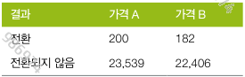

# Chapter 3 통계적 실험과 유의성 검정

## 1. A/B 검정
### keyword
```
- 처리(treatment) : 어떤 대상에 주어지는 특별한 환경이나 조건
- 처리군 : 특정 처리에 노출된 대상들의 집단
- 대조군 : 어떤 처리도 하지 않은 대상들의 집단
- 임의화(랜덤화) : 처리를 적용할 대상을 임의로 결정하는 것
- 대상(피실험자자) : 처리를 적용할 개체 대상
- 검정통계량 : 처리 효과를 측정하기 위한 지표
```

### A/B 검정 예시

- **대상** : 고객
- **처리군** : 변경가격(가격A)를 확인한 고객 
- **대조군** : 기존가격(가격B)를 확인한 고객
  - 대조군이 꼭 필요한가? -> 대조군과 처리군의 차이는 보통 하나. 그 외는 모두 동일 => 대조군이 없다면 비교대상의 차이가 많아질 수 있음.(변인 통제 불가)
- 목적 : 가격A(변경된 가격)와 가격B(기존가격)의 전환율 비교 -> 전환율 차이가 유의미한가? 어느 가격이 더 효과적인가?

---

## 2. 가설검정(유의성 검정)
### keyword
```
- 귀무가설(영가설) : 우연 때문이라는 가설
- 대립가설 : 귀무가설과 대조되는 가설 = 증명하고자 하는 가설
- 일원검정 : 한 방향으로만 우연히 일어날 확률 계산하는 가설검정
- 이원검정 : 양방향으로 우연히 일어날 확률을 계산하는 가설검정
```

### 임의성에 대한 오해 
사건a 일어날 확률과 사건b 일어날 확률이 동일하지만, 사건a가 연달아 일어나면 그 후에는 사건b가 일어날 가능성이 높다고 생각하는 오해 

-> 사건a가 연달아 일어난 것은 우연이지만, 단순한 우연이 아닐 것이라 착각

### 귀무가설과 대조가설
❓귀무가설을 따로 두는 이유는?

귀무가설(증명하고자 하는 가설가 완전히 대조되는 가설)이 **틀림을 입증**함으로써 대조가설을 증명하고자 함

### 일원/이원 가설검정 예시
(1) 일원 가설검정
- 가설 : 특정 브랜드의 배터리 수명은 400시간 이상일 것이다. 
  - H0 : 배터리 수명은 400시간 이상이 아니다.
  - H1 : 배터리 수명은 400시간 이상이다. 

(2) 이원 가설검정
- 가설 : 어떤 커피 브랜드가 주는 고객 만족도에 대해, 커피의 **종류**와 **가격**이 영향을 미칠 것이다. 
  - H0 : 커피 종류와 가격이 고객 만족도에 미치는 영향을 주지 않는다. 
  - H1 : 커피 종류와 가격이 고객 만족도에 영향을 미친다. 

=> 검정하고자 하는 기준이 **1개**이면 **일원가설검정**, **2개**라면 **이원가설검정**
=> ❓검정하고 싶은 기준이 **3개 이상**이라면??? => **분산분석(ANOVA)**

## ANOVA(분산분석)
### keyword
```
- 쌍별 비교 : 여러 그룹 중 두 그룹 간의 가설검정
- 총괄검정 : 여러 그룹 평균들의 전체 분산
- F 통계량 : 그룹 평균 간의 차이가 랜덤 모델에서 예상되는 것에서 벗어나는 정도를 측정하는 표준화된 통계량 
```
-
### ANOVA 예시
- 상황 : 한 교육업체가 세 가지 수업 방식이 **시험 성적에 미치는 효과**를 비교하고자 함(학생들의 시험점수 측정을 통해)
  - 그룹 A : 온라인 강의
  - 그룹 B : 오프라인 강의
  - 그룹 C : 혼합형 강의

- 목적 : 세가지 수업 방식 중 어느 하나라도 평균 시험 점수가 유의하게 다르다면 그걸 알고 싶음
  - H0 : 세 그룹의 평균 시험점수는 모두 같다
  - H1 : 적어도 하나의 그룹의 평균은 다르다
- 과정 : 각 그룹의 평균 및 분산을 계산하고 F통계량을 계산하여 세 그룹 간 분산과 집단 내 분산 비교
- 결론 : p값 < 0.05일 경우 세 수업 방식 중 차이가 있음을 알 수 있음 (⚠️단, 어떤 것이 다른지는 **사후검정**을 통해 알아내야함)

### F통계량
- 계산 : 집단 간 분산 / 집단 내 분산
- F값이 클수록 **집단 간 차이가 크고, 통계적으로 유의할 가능성** 높음

### 일원분산분석 vs 이원분산분석(일원 가설검정 vs 이원가설검정과 유사)
| 항목         | 일원분산분석 (One-Way ANOVA) | 이원분산분석 (Two-Way ANOVA) |
| ---------- | ---------------------- | ---------------------- |
| 독립 변수 수    | 1개                     | 2개                     |
| 상호작용 고려 여부 | ❌ 없음                   | ✅ 가능                   |
| 예시         | 수업방식 → 시험점수            | 수업방식, 성별 → 시험점수        |
| 결과 해석      | 그룹 간 평균 차이 있는지         | 각 요인의 영향 + 상호작용 효과 파악  |


---

## 3. 재표본추출
### keyword
```
- 순열검정(임의화검정) : 두 개 이상의 표본을 함께 결합하여 관측값들을 무작위로 추출하는 과정
- 재표본추출 : 관측 데이터로부터 반복해서 표본추출하는 과정
- 복원/비복원 : 표본을 추출할 때 이미 한 번 뽑은 데이터를 다시 넣기(복원)/안 넣기(비복원)
```
### 순열검정 예시
- 상황설정
  - 목표 : 웹 디자인 2가지를 비교하여 어느 디자인이 더 효과적인지 사용자가 웹 페이지에 머무는 시간으로 측정한다. 
  - H0 : 두 디자인 간 **사용자 상호작용 시간** 에 차이가 없다. 
  - H1 : 두 디자인 간 **사용자 상호작용 시간** 에 차이가 있다. 
- 데이터
  - 디자인 A : 200명의 사용자, 평균 상호작용 시간 5분
  - 디자인 B : 200명의 사용자, 평균 상호작용 시간 6분

- 순열검정 절차
1) 실제 데이터에서 두 디자인의 상호작용 시간 확인
2) H0에 따라 두 그룹의 데이터를 섞는다. 
   - 두 그룹의 상호작용 시간을 하나의 **혼합된 데이터셋**으로 합쳐서 총 400명의 사용자 상호작용 데이터를 확보
3) 혼합된 데이터셋에서 200명의 사용자씩 랜덤으로 다시 그룹을 분류해서 평균 상호작용 시간을 계산
4) 여러 번 반복하여 수많은 평균 데이터를 확보하고, 이를 기반으로 두 디자인 간 차이가 우연에 의한 차이일 가능성을 평가한다. 
   - p값을 계산하여 **유의수준보다 작다면 H0 기각**

### 전체 및 부트스트랩 순열검정
(1) 전체검정 : 순열검정 전부 해본 것
(2) 부트스트랩 순열 검정 : 전체검정을 현실적으로 구현 불가능할 때 **무작위 재표본추출(복원추출)**로 근사화

| 항목    | 전체검정            | 부트스트랩 순열검정       |
| ----- | --------------- | ---------------- |
| 계산 방식 | 가능한 모든 경우의 수 계산 | 무작위 복원 추출 반복     |
| 정확도   | 매우 높음           | 반복 수에 따라 정확도 달라짐 |
| 효율성   | 샘플 수 많으면 비효율적   | 효율적 (대규모 데이터 적합) |
| 무작위성  | 없음 (결정적)        | 있음 (확률적 결과)      |
| 사용 시점 | 샘플 수 적을 때       | 샘플 수 많을 때        |

## 4. 통계적 유의성과 p값
### keyword
```
- p값 : H0을 구체화한 모델이 주어졌을 때 관측된 결과와 같이 특이하거나 극단적인 결과를 얻을 확률
- 알파 : 우연에 의한 결과가 능가해야하는 비정상적인 가능성의 임계 확률
- 제1종 오류 : 우연에 의한 효괄르 실제 효과라고 잘못 결론 내리는 것
- 제2종 오류 : 실제 효과를 우연에 의한 효과라고 잘못 결론 내리는 것
```
### 예시

- 상황 : 두 가격의 전환율 차리는 0.0368%
- 과정 : 무작위 순열검정을 반복하여 두 그룹간 비율 차이를 계속 기록
- 유의성 검정 : 이 차이가 얼마나 자주 >=0.0368% 인가??

## 5. t검정
### keyword
```
- 검정통계량 : 관심의 차이 또는 효과에 대한 측정 지표
- t 통계량 : 평균과 같이 표준화된 형태의 일반적인 검정통계량
- t 분포 : 관측된 t 통계량을 비교할 수 있는 (귀무가설에서 파생된) 기준분포
```

### t검정 이해하기
- df(자유도) = 보통 n(표본 크기) - 1
- 현재 내 표본의 t값을 구한 후 df에 해당하는 t분포를 참고하여 유의성 검정

## 6. 다중검정
### keyword
```
- 제1종 오류 : 어떤 효과가 통계적으로 유의미하다고 잘못된 결론을 내림
- 거짓발견비율 : 다중검정에서 1종 오류가 발생하는 비율
- 알파 인플레이션 : 1종 오류를 만들 확률인 알파가 더 많은 테스트를 수행할수록 증가하는 다중검정 현상
- p값 조정 : 동일한 데이터에 대해 다중검정을 수행하는 경우에 필요하다
```

### 예시
- 상황 : 어떤 제약회사가 10종의 신약을 개발했고, 각각이 **혈압을 낮추는 효과가 있는지** 알아보고자 함 => **10개의 독립적인 t검정** 수행
- t검정을 10번하면? **전체 오류 확률 = 1-(1-0.05)^10 = 약40%
- **거짓 양성의 위험이 커지는** 결과
- 해결방안
  1) 보너퍼로니 보정 : 각 검정의 유의수준을 알파/m번(이 상황에선 10) 으로 낮춤
  2) FDR : 모든 p값을 정렬하고 발견된 것 중 거짓일 확률을 통제

❓이런 문제가 있는데 다중검정을 안 하면 되는 문제 아닌가

반례 1) 유전자 분석 : 유전자 20000개 중 질병과 관련된 유전자를 찾고 싶으면 20000번의 검정을 해야함.(한 번에 해버리면 수천개가 우연히 유의하게 나옴)

반례 2) A/B테스트 여러 개 : UI 버튼 색상, 배치, 텍스트 등 조건이 n개면 n번의 검정 필요

반례 3) 뇌과학, fMRI : 뇌의 수천 개 픽셀마다 활성화 여부 검정 

💡다중검정이 문제가 아니라, 보정을 안하는 것이 문제이기 때문에 보정을 하고 해석에 주의를 기울이면 됨

## 자유도
### keyword
```
d.f.(degree of freedom) : 자유도
```

### 왜 표본의 자유도는 n-1?
- 모집단이 아닌 표본은 n-1개의 데이터가 정해지면 마지막 n번째 데이터는 확정이 됨
- ⚠️표본의 자유도를 n으로 둘 경우? **다중공산성**의 문제 야기 가능

## 8. 카이제곱통계량
### keyword
```
- 카이제곱통계량 : 기댓값으로부터 어떤 관찰값까지의 거리를 나타내는 측정치
```

### 카이제곱통계량 예시
- 상황 : 한 마트에서 **고객 성별**과 **구매한 과일 종류**가 관련이 있는지 확인하고 싶음
  - 사과 : 남 30 여 50
  - 바나나 : 남 40 여 20
  - 딸기 : 남 30 여 30

- 목적 : 성별과 과일은 독립인가? 관련이 있는가?
  - H0 : 성별과 과일 구매는 관련이 없다
  - H1 : 성별과 과일 구매는 관련이 있다다
- 해석 : 카이제곱분포표에서 해당 자유도 기준으로 p값 계산 -> 만약 카이제곱통계량이 크고 p<0.05라면 H0 기각(관련이 있음)


## 9.멀티 암드 밴딧 알고리즘
### keyword
```
- 멀티암드 밴딧 : 고객이 선택할 수 있는 손잡이가 여러개인 가상의 슬롯머신을 말하며, 각 손잡이는 각기 다른 수익을 가져다준다. 
- 손잡이 : 실험에서 어떤 하나의 처리
- 상금 : 슬롯머신으로 딴 상금에 대한 실험적 비유
```

### 멀티암드뱃딧알고리즘 활용 사례
1) 광고 최적화
- 상황 : 여러 광고 배너 중 어떤게 클릭률이 높은지 모름
- 문제 : A/B/n 테스트처럼 모든 광고를 일정 기간 뿌리면, 성능 낮은 광고도 계속 노출됨 
- 해결 : 뱃딧 알고리즘을 사용해 성능 좋은 광고를 점점 더 많이 노출하면서 새로운 광고도 조금씩 탐색