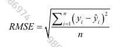
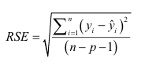
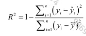
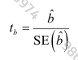
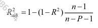
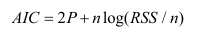
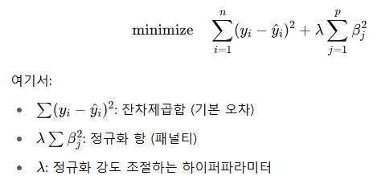
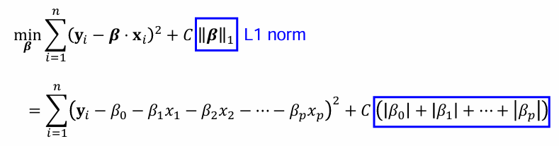
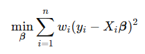
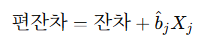

# 4. 회귀와 예측
## 1. 단순선형회귀
### keyword
```
- 종속변수 : 예측하고자 하는 변수 Y
- 독립변수 : Y를 예측하기 위해 사용되는 변수 X
- 레코드(행, 사건) : 한 특정 경우에 대한 입력과 출력을 담고 있는 벡터
- 절편 : 회귀직선의 절편(X=0일 때)
- 회귀계수 : 회귀직선의 기울기
- 적합값(예측값) : 회귀선으로부터 얻은 추정치
- 잔차 : 관측값과 예측값의 차이
- 최소제곱 : 잔차의 제곱합을 최소화하여 회귀를 피팅하는 방법
```

### 최소제곱
- 실무에서의 선형회귀선 : **OLS** (잔차제곱합(RSS)을 최소화하는 선)
  - ⚠️평균과 마찬가지로 특잇값에 매우 민감 -> 크기가 크지 않은 경우 사용에 주의해야함

### 회귀의 활용 비교
|구분|설명적 회귀분석|예측적 회귀분석|
|---|---|---|
|정의|x변수와 y변수 사이의 관계 설명|x변수를 이용해 타겟변수y 예측|
|목표|모델에서 x변수의 영향력 파악|예측 정확도 높이기|
|평가방식|R^2, 잔차분석, p값을 통한 적합도 계산|MSE, RMSE 등을 통한 정확도 계산|
|활용|통계학에서 설명적 회귀분석|데이터 마이닝에서 예측 회귀분석|
|사례|나이와 혈압 사이의 관계 이해|나이를 바탕으로 혈압 예측|

## 2. 다중선형회귀
### keyword
```
- RMSE(root mean squared error) : 회귀 시 평균제곱오차의 제곱근(회귀 모형을 평가하는 데 가장 널리 사용되는 측정 지표)
- RSE(residual standard error) : 평균제곱오차와 동일하지만 자유도에 따라 보정된 값
- R 제곱(결정계수) : 0에서 1까지 모델에 의해 설명된 분산의 비율
- t 통계량 : 계수의 표준오차로 나눈 예측변수의 계수(변수의 중요도 기준)
- 가중회귀 : 다른 가중치를 가진 레코드들을 회귀하는 방법 
```
### 모형 평가
(1) RMSE 제곱근평균제곱오차



(2) 잔차 표준오차 



❓분모에 n-p-1을 쓰는 이유
- 회귀식을 만들기 위해 p개의 독립변수와 절편 1개를 포함해 총 p+1개의 회귀계수를 데이터로부터 추정 -> 추정과정에서 자유도를 p+1개만큼 사용함 
- 따라서 잔차 계산에 쓸 수 있는 자유도는 원래 자유도(n)-추정에 사용한 자유도(p+1)
- 단순히 n으로만 나누면 오차를 과소평가하게 되기 때문에 보정 필요

(3) R제곱 통계량(결정계수) - 모델의 적합성 평가



(4) t 통계량



(5) 수정 R 제곱 - 모델의 복잡성(변수의 수)까지 고려됨됨



(6) AIC - 모델에 항을 추가할수록 불이익을 줌 -> 최소화해야함함



### 모형 선택 및 단계적 회귀

❓AIC를 최소로하거나 수정 R제곱을 최대로 하는 모델 찾는 방법?
- 부분집합회귀 -> 비용이 많이 들고 빅데이터에 부적합
- 단계적 회귀 
  - 후진제거 : 전체 모델로 시작하여 의미없는 변수 삭제
  - 전진선택 : 상수 모델에서 시작하여 변수 추가 
- 벌점회귀
  - 능형회귀 



  - 라소회귀



### OLS(선형회귀) vs WLS(가중회귀)
| 항목    | OLS (일반 선형회귀) | WLS (가중 회귀)      |
| ----- | ------------- | ---------------- |
| 오차 가정 | 등분산           | 이분산 허용           |
| 가중치   | 모두 동일 (1)     | 개별적으로 다름 ($w_i$) |
| 목적    | 전체 평균적 오차 최소화 | 가중 오차 최소화        |

  - WLS 목적함수 



## 3. 회귀를 이용한 예측
### keyword
```
- 예측구간 : 개별 예측값 주위의 불확실한 구간
- 외삽법 : 모델링에 사용된 데이터 범위를 벗어난 부분까지 모델을 확장하는 것
```

### 예측구간 vs 신뢰구간
| 항목    | **신뢰구간 (Confidence Interval)**    | **예측구간 (Prediction Interval)**                        |
| ----- | --------------------------------- | ----------------------------------------------------- |
| 의미    | 평균값(모형의 예측값)의 **불확실성 범위**         | **개별 관측값**의 불확실성 범위                                   |
| 대상    | 평균 $\hat{y}$                      | 실제 관측값 $y_{\text{new}}$                               |
| 분산 크기 | 작음 (오직 추정 오차만 반영)                 | 큼 (추정 오차 + 데이터 자체의 분산 모두 반영)                          |
| 포함 관계 | 예측구간이 항상 신뢰구간보다 넓음                | ⊇                                                     |

#### 예시
1. 신뢰구간: 모든 학생의 평균 성적이 몇 점쯤일까?

어떤 반 학생 중 10명의 학생의 시험 평균이 80점
- 과연 이 반 전체 학생들의 진짜 평균 성적은?
- 10명만 뽑은거라 80점은 오차가 존재
- 신뢰구간 : 이 반의 평균 성적을 얘기할 때는 95%의 확률로 77점 ~ 83점 사이

2. 예측구간 : 한 한명의 학생은 약 몇 점?

- 반 전체 평균보다 오차가 훨씬 클 가능성이 있음
- 예측구간 : 이 학생은 95%의 확률로 60~100점 사이

=> 예측구간의 범위가 신뢰구간의 범위보다 크거나 같을 수 밖에 없음

## 4. 회귀에서의 요인변수
### keyword
```
- 가변수 : 회귀나 다른 모델에서 요인 데이터를 사용하기 위해 0과 1의 이진변수로 부호화한 변수
- 기준 부호화 : 한 요인을 기준으로 하고 다른 요인들이 이 기준에 따라 비교할 수 있도록 함
- 원-핫 인코딩 : ML에서는 유용한 반면 다중선형회귀에는 적합하지 않음
- 편차 부호화 : 기준 수준과는 반대로 전체 평균에 대해 각 수준을 비교하는 부호화 방법
```

### 부호화
- 총합 대비 부호화:

→ 모든 그룹의 평균을 중심으로, 각 그룹이 얼마나 위/아래인가?
예: "우리 조 평균보다 A조는 얼마나 높은가?"

→ 평균 중심 해석이 중요할 때 사용

- 편차 부호화:

→ 기준 집단 없이 전체 평균과의 차이를 강조
예: "전체 평균이 75인데 B조는 80, 즉 +5"

→ 집단 간 편차 비교 시 사용 

- 다항식 부호화:

→ 그룹 간 순서를 고려함
예: 고등학교 1학년, 2학년, 3학년처럼 단계적 차이가 의미 있을 때

→ 순서가 있는 요인변수일 때 사용 

- 원-핫 인코딩

→ 기준 범주를 제외하고 각 수준을 개별 이진변수로 만듦

→ 일반적인 회귀모델에서 가장 많이 사용

## 5. 회귀방정식 해석
### keyword
```
- 변수 간 상관관계
- 다중공산성 : 예측 변수들이 완벽하거나 거의 완벽에 가까운 상관성을 갖는다고 할 때 회귀는 불안정하며 계산이 불가능
- 교란변수 : 중요한 예측변수이지만 회귀방정식에 누락되어 결과를 잘못되게 이끄는 변수
- 독립변수(주효과) : 다른 변수들과 독립된 하나의 예측변수와 결과변수 사이의 관계
```

### 다중공산성
- 발생상황
  - 오류로 인해 한 변수가 여러 번 포함된 경우
  - 요인변수로부터 p-1개가 아닌 p개의 가변수가 만들어진 경우
  - 두 변수가 서로 거의 완벽하게 상관성이 있는 경우

- 😲 다중공산성은 트리, 클러스터링, 최근접 이웃, 앙상블, 신경망망 등 비선형 모델에서는 큰 문제가 되지 않음

### 교란변수
- 회귀방정식에 중요한 변수가 포함되지 못해서 생기는 **누락의 문제**
  - Z -> X , Z -> Y => X->Y 로 착각하게 함
- 예시
  - 관찰결과 : 커피를 많이 마시는 사람일수록 심장병이 많다
  - 잘못된 결론 : 커피가 심장병을 유발한다
  - 교란변수 Z : 흡연 여부
  - 커피를 많이 마시는 사람들은 흡연자일 가능성이 높고 흡연은 심장병의 원인 -> 잘못된 인과관계를 추정하게 됨

## 6. 회귀진단
### keyword
```
- 표준화잔차 : 잔차를 표준오차로 나눈 값 
- 영향값 : 있을 때와 없을 때 회귀방정식이 큰 차이를 보이는 값
- 레버리지 : 회귀식에 한 레코드가 미치는 영향력의 정도
```

### 특잇값
- 표준화잔차를 이용해서 특잇값 발견 가능
  - 정상적인 데이터는 표준화 잔차가 보통 -2~2 사이

### 영향값
- 회귀모델에서 특정 관측치를 제거했을 때 크게 바뀌는 데이터
  - 단순히 잔차가 크다고 영향력이 크지는 않음
  - 회귀선 전체 모양에 영향을 주는 관측치여야함

- 주요 판단 기준
  1. 레버리지

| 항목 | 설명                                         |
| -- | ------------------------------------------ |
| 정의 | 해당 관측치가 **X 공간상에서 얼마나 극단적인 위치에 있는지** 나타냄   |
| 계산 | hat matrix의 대각 원소: $h_{ii}$                |
| 기준 | $h_{ii} > \frac{2(p+1)}{n}$ 이면 **높은 레버리지** |
| 의미 | X가 극단적일수록 → 예측값이 그 관측치에 의해 크게 결정됨          |

  2. 쿡의 거리

| 항목     | 설명                                                       |
| ------ | -------------------------------------------------------- |
| 정의     | 관측치를 제거했을 때 회귀계수가 **얼마나 변하는지** 측정                        |
| 구성     | 레버리지 + 잔차 크기 모두 반영                                       |
| 경험적 기준 | $D_i > \frac{4}{n - p - 1}$ 또는 $D_i > 0.08$이면 영향력 높다고 판단 |
| 시각화    | 쿡의 거리가 큰 점을 그래프에 **큰 원으로 표시** (두 번째 이미지 참고)              |

### 오차의 성질 분석

| 문제    | 무슨 뜻?           | 왜 문제?        |
| ----- | --------------- | ------------ |
| 이분산성  | 예측값 커질수록 잔차도 커짐 | 예측 불안정       |
| 비정규성  | 잔차가 종 모양 아님     | 신뢰구간/검정 잘 안됨 |
| 오차 상관 | 잔차끼리 서로 영향 줌    | 독립 가정 깨짐     |

### 편잔차 (비선형성 탐지)



- 다른 변수들을 통제한 상태에서 특정변수와 종속변수가 선형관계인가? 를 시각적으로 확인 가능 -> 직선(선형)/곡선(비선형)

## 7. 다항회귀와 스플라인 회귀
### keyword
```
- 다항회귀 : 회귀모형에 다항식 항을 추가한 방식
- 스플라인 회귀 : 다항 구간들을 부드러운 곡선 형태로 피팅
- 매듭 : 스플라인 구간을 구분하는 값들
- GAM(일반화가법모형) : 자동으로 구간을 결정하는 스플라인 모델
```

| 항목         | **다항회귀 (Polynomial Regression)**                                          | **스플라인 회귀 (Spline Regression)**        |
| ---------- | ------------------------------------------------------------------------- | -------------------------------------- |
| **아이디어**   | 전체 구간에서 하나의 곡선(고차 다항식)으로 표현                                               | **구간별로 다른 곡선/직선을 부드럽게 이어붙임**           |
| **수식 형태**  | $Y = \beta_0 + \beta_1 X + \beta_2 X^2 + \cdots + \beta_d X^d + \epsilon$ | 각 구간마다 다른 회귀식 사용 + 경계점(knot)에서 부드럽게 연결 |
| **유연성**    | 차수(d)를 올릴수록 곡선이 유연해짐                                                      | knot 개수/위치 조절로 유연성 제어 가능               |
| **위험점**    | 차수를 너무 높이면 **과적합, 발산** 가능                                                 | **과적합 방지에 유리** (GAM, 매끈하게 제어됨)         |
| **사용 용도**  | 단순한 곡선 관계 설명 (ex. U자형, 포물선)                                               | 복잡하거나 구간마다 패턴이 다른 경우                   |
| **시각적 특성** | 곡선 전체가 하나로 움직임                                                            | **부분적으로 구부러지고 유연함**                    |
| **예시**     | 면적이 클수록 집값이 증가하되, 일정 이상은 증가폭 감소                                           | 약물 반응, 광고 예산 효과 등 구간별 변화가 뚜렷한 경우       |
