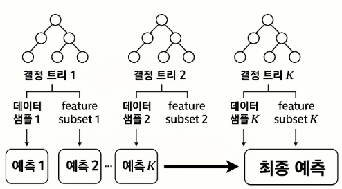
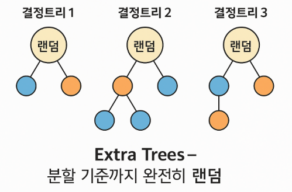
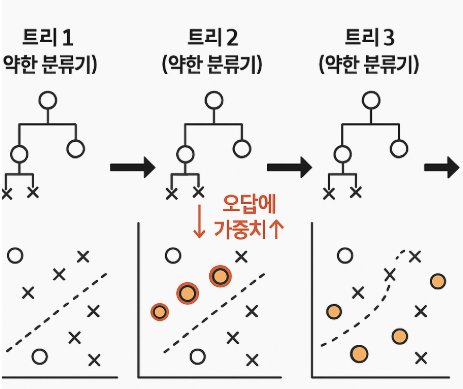
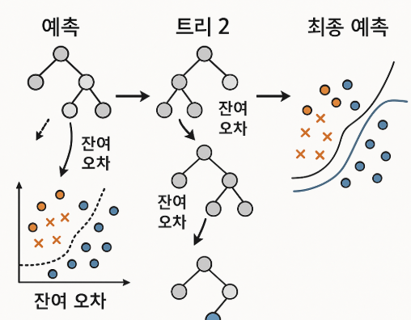

# 통계학 스터디 마지막 과제 !!

## k-nn vs k-menas clustering

| 구분         | k-NN (k-Nearest Neighbors)                                           | k-means Clustering                                             |
| ---------- | -------------------------------------------------------------------- | -------------------------------------------------------------- |
| **종류**     | 지도학습(분류/회귀)                                                          | 비지도학습(군집화)                                                     |
| **목적**     | 레이블 예측(분류 or 회귀)                                                     | 데이터 그룹(클러스터) 찾기                                                |
| **입력 데이터** | 특징(Feature) + (학습 시) 레이블                                             | 특징(Feature)만                                                   |
| **k의 의미**  | 예측에 참고하는 이웃 데이터 개수                                                   | 나눌 클러스터(집단) 개수                                                 |
| **동작 방식**  | 새로운 데이터가 주어지면, 전체 데이터 중에서 거리가 가까운 k개를 찾아, 그 이웃들의 레이블을 보고 다수결/평균으로 예측 | 데이터 내에서 k개 중심(centroid) 만들고, 각 데이터를 가까운 중심에 할당. 이걸 반복하며 중심 재조정 |
| **결과**     | 새로운 데이터의 클래스(분류) 또는 값(회귀)                                            | 각 데이터가 속한 군집(클러스터)                                             |
| **학습 과정**  | 별도 학습 없음(메모리 기반)                                                     | 반복적인 학습(centroid 위치 조정)                                        |
| **주요 용도**  | 분류(Classification), 회귀(Regression)                                   | 군집화(Clustering), 패턴 탐색                                         |

---

## 앙상블 기법

### 1. 배깅(Bagging, Bootstrap Aggregating)
- **정의**: 원본 데이터에서 여러 번 샘플링(부트스트랩)하여 여러 모델(동일 알고리즘)을 병렬로 학습, 결과를 평균/다수결로 합침
- **목적**: 분산(variance) 감소, 과적합 방지
- **대표 활용 예**: Random Forest, BaggingClassifier

### 2. 부스팅(Boosting)
- **정의**: 약한 학습기(주로 얕은 트리)를 순차적으로 연결, 이전 모델이 틀린(오답) 데이터에 가중치↑ 후, 다음 모델이 오답을 보완하도록 학습
- **목적**: 편향(bias) 및 분산(variance) 모두 감소, 복잡한 패턴 예측
- **대표 활용 예**: AdaBoost, Gradient Boosting, XGBoost, LightGBM

### 3. 스태킹
- **정의**: 서로 다른 여러 알고리즘(모델)의 예측값을 새로운 메타모델의 입력으로 사용하여 최종 예측
- **목적**: 다양한 모델의 장점 조합, 예측 성능 극대화
- **대표 활용 예**: StackingClassifier, StackingRegressor (sklearn)

| 기법     | 핵심 원리                         | 결합 방식 | 대표 알고리즘/사용 예시        |
|----------|-----------------------------------|-----------|-----------------------------|
| 배깅     | 부트스트랩 샘플+병렬 학습           | 병렬      | Random Forest, Bagging      |
| 부스팅   | 오답 가중치 조정+순차적 학습        | 순차      | AdaBoost, XGBoost, LightGBM |
| 스태킹   | 여러 모델 결과를 메타모델에 입력    | 병렬+후처리| StackingClassifier 등        |

---

## 트리 모델

### Random Forest



- **설명** : 여러 개의 decision tree를 무작위 feature와 데이터 샘플로 학습한 후 결과를 투표(분류) 또는 평균(회귀)해서 예측
- **장점** : 과적합에 강하고, 기본 성능이 안정적이며 변수 중요도 해석 가능
- **주요 파라미터**
    - n_estimators : 트리 개수
    - max_depth : 트리 최대 깊이
    - max_features : 각 트리 분할 시 고려할 feature 수
    - min_samples_split : 리프노드가 되기 위한 최소 샘플 수
    - bootstrap : 부트스트랩 샘플링 사용 여부

### Extra Trees (Extremely Randomized Trees)



- **설명** : Random Forest와 유사하지만, 노드 분할 시 최적 분할 대신 **완전히 무작위**로 나눔
- **장점** : Random Forest보다 더 빠르고, 분산이 더 낮음(편향은 높을 수 있음)
- **주요 파라미터**
    - n_estimators, max_depth, max_features 등 Random Forest와 동일
    - splitter : 'random' (무작위 분할 사용)

### AdaBoost



- **설명** : 약한 모델(주로 depth=1의 decision tree)을 순차적으로 학습하며, 이전 모델이 틀린 샘플에 가중치 부여
- **장점** : 단순 구조에도 불구하고 예측력이 높고, 과적합에 비교적 강함
- **주요 파라미터**
    - n_estimators : 약한 모델(weak learner) 개수
    - learning_rate : 각 모델의 기여도 조절
    - base_estimator : 약한 모델(기본은 DecisionTreeClassifier)

### Gradient Boosting



- **설명** : AdaBoost와 같이 트리를 순차적으로 학습하지만, 잔여 오차(gradient)를 보정하는 방향으로 트리를 추가
- **장점** : 예측력이 매우 강하고, 다양한 손실 함수와 하이퍼파라미터로 커스터마이징 가능
- **주요 파라미터**
    - n_estimators : 트리 개수
    - learning_rate : 학습률
    - max_depth : 각 트리의 최대 깊이
    - subsample : 학습에 사용할 데이터 샘플 비율(과적합 방지)
    - loss : 손실 함수 종류

### Support Vector Classifier (SVC)
- **설명** : 고차원 공간에서 데이터를 분리하는 결정 경계를 찾으며, 마진을 최대화하는 방향으로 학습
- **장점** : 고차원 데이터와 비선형 분류 문제에 강점, 다양한 커널 사용 가능
- **주요 파라미터**
    - C : 마진의 너비와 오차 허용 간의 균형
    - kernel : 커널 함수 종류(linear, poly, rbf, sigmoid 등)
    - gamma : rbf/poly 커널의 곡률(복잡도) 제어
    - degree : poly 커널의 다항식 차수

---

## 주성분 분석 (PCA, Principal Component Analysis)

### 개념 및 목적
- 여러 변수(고차원 데이터)가 있을 때, 이들을 새로운 축(주성분, Principal Component)으로 변환하여 **데이터 분산을 최대한 보존하면서** 차원을 줄이는 기법
- 데이터 내 **중복 정보(상관관계)**를 제거하고, 가장 “정보가 많은” 방향(분산이 큰 방향)으로 데이터를 투영함
- 주로 **차원 축소**, **데이터 시각화**, **노이즈 감소**, **특성 간 상관관계 해소** 등에 활용

### 원리 및 동작 과정
1. **데이터 정규화(표준화)**  
   - 각 변수의 단위가 다를 경우 분산이 왜곡될 수 있으므로, 평균 0, 표준편차 1로 변환
2. **공분산 행렬 계산**  
   - 변수 간 분산/공분산 정보(상관성)를 담은 행렬 생성
3. **고유값 분해/특이값 분해(SVD)**  
   - 공분산 행렬을 분해하여, “데이터 분산을 가장 많이 설명하는 방향(주성분)”과 그 크기(고유값)를 계산
4. **주성분 축 선택 및 정렬**  
   - 분산 설명력이 큰 순서대로 새로운 축(주성분) 선택
   - 각 주성분은 서로 직교(orthogonal), 즉 상관관계가 없음
5. **데이터 투영 및 차원 축소**  
   - 원본 데이터를 상위 몇 개 주성분 축에 투영(Projection)  
   - 이때 보존되는 분산(=정보)의 비율도 함께 확인

### 해석과 활용
- **PC1**: 데이터의 분산(정보)을 가장 많이 설명하는 축  
- **PC2**: 그 다음으로 많은 정보를 담은 축  
- 실제 데이터의 주요 구조, 군집(클러스터), 이상치 등을 **2~3차원 시각화**로 쉽게 파악할 수 있음
- 각 주성분(PC)은 원본 변수의 **선형 조합**이므로, 어떤 변수들이 주로 설명력에 기여하는지 해석 가능(loading 값 활용)
- 주성분의 “누적 설명력”을 통해 차원을 어디까지 줄일지 판단 (예: 전체 분산의 90%를 설명하는 주성분 수)

### 장점
- **차원 축소**로 시각화, 연산 효율 향상, 노이즈 감소
- 변수 간 **상관관계 제거** (모든 주성분은 직교)
- 설명력이 높은 방향만 남기므로 데이터 요약 및 정보 압축 가능

### 한계/주의점
- **선형적 구조**만 포착(비선형 패턴은 잘 설명 못함)
- 주성분이 원래 변수의 해석과 일치하지 않을 수 있음(직관적 해석 어려움)
- 희소성 데이터, 카테고리형 데이터엔 부적합할 수 있음

### 실전 활용 예시
- 고차원 데이터의 2~3차원 **시각화(biplot, scatter plot)**
- 머신러닝 전처리(차원 축소 후 모델 학습)
- 이미지 압축, 이상치 탐지 등

---

## 덴드로그램(Dendrogram) 실무 활용 예시 가 항상 궁금했어욮 

### 1. 고객 세분화(Customer Segmentation)
- 여러 변수(구매액, 방문 빈도, 활동 등)로 고객 간 유사도(거리)를 계산
- 계층적 군집화(Hierarchical Clustering)로 덴드로그램을 그려 그룹 구조 및 최적 군집 수를 시각적으로 파악
- **파이썬 예시 코드**

```python
import pandas as pd
from scipy.cluster.hierarchy import dendrogram, linkage
import matplotlib.pyplot as plt

data = pd.DataFrame({
    "frequency": [5, 6, 4, 10, 12, 11],
    "monetary": [100, 80, 90, 250, 230, 240]
})

linked = linkage(data, method='ward')
plt.figure(figsize=(6, 4))
dendrogram(linked, labels=data.index.tolist())
plt.title("고객 덴드로그램")
plt.xlabel("고객 Index")
plt.ylabel("거리(Distance)")
plt.show()
```
```text
덴드로그램을 보면서 클러스터 몇 개로 나눌지 생각하는거군
```

### 2. 유전자/단백질 데이터 분석 (Bioinformatics)
- 유전자 발현량, 단백질 프로파일 등 생명과학 데이터에서 샘플 간 또는 유전자 간 유사도를 계층적 군집화로 분석
- 덴드로그램 + 히트맵(heatmap)을 함께 시각화하여, 유전자 “패밀리”/샘플 그룹 패턴 탐색 및 새로운 바이오마커 후보 찾기에 활용

### 3. 문서/텍스트 군집화
- 여러 문서(뉴스, 논문, 상품평 등) 간 TF-IDF, 워드 임베딩 등으로 거리/유사도를 계산
- 계층적 군집화 및 덴드로그램을 통해 문서 주제별 그룹 구조, 유사한 문서군을 시각적으로 한눈에 파악
- 주제별 분류 전, 전체 데이터 구조를 빠르게 탐색하는 데 도움

### 4. 상품/아이템 유사도 분석
- 상품 속성(가격, 브랜드, 카테고리, 판매량 등)으로 계층적 군집 분석을 실시
- 덴드로그램으로 상품 간 계층 구조를 파악하여 라인업 재정비, 마케팅 타겟팅, 유사 상품 추천 전략 등에 적용

### 5. 변수(Feature) 유사성 탐색
- 다수 변수(피처) 간 상관관계나 거리 기반으로 계층적 군집화 수행
- 덴드로그램을 통해 비슷한 변수 그룹(Feature group) 발견 → 변수 선택, 다중공선성 문제 진단, 차원축소 전 해석 등에 활용

---
